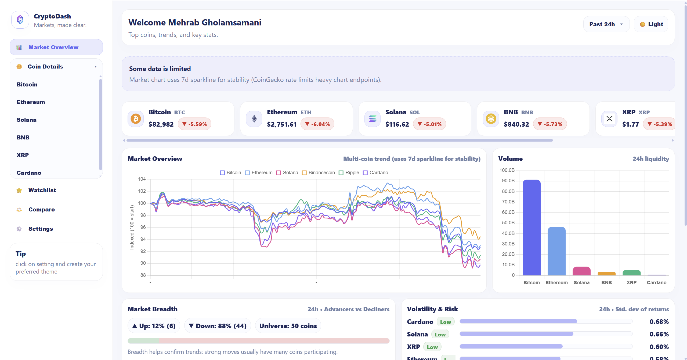
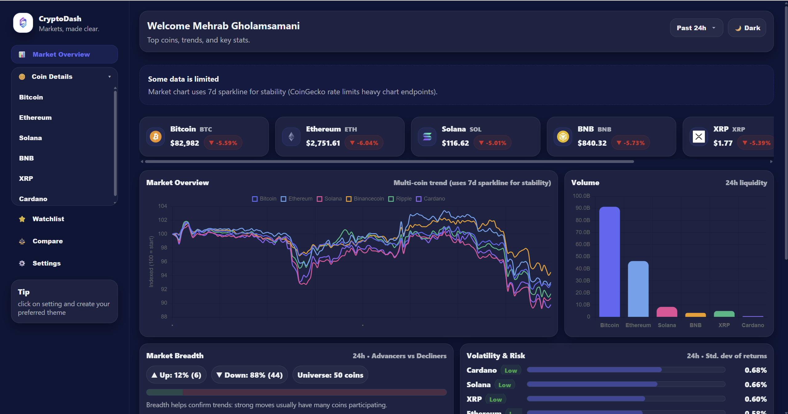
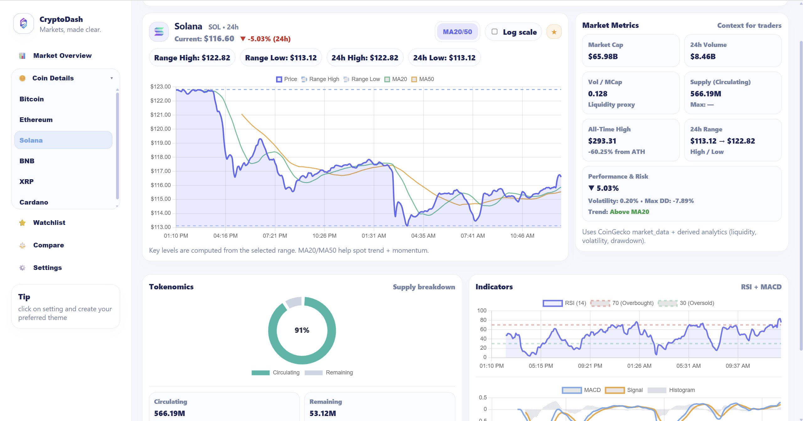
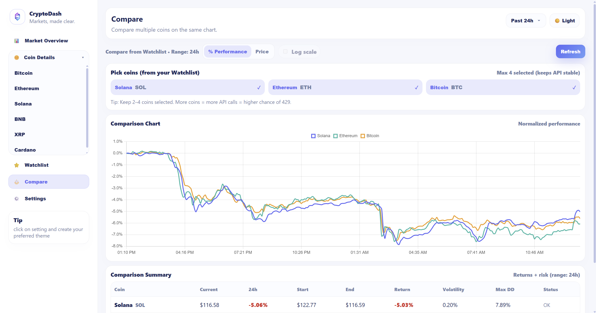
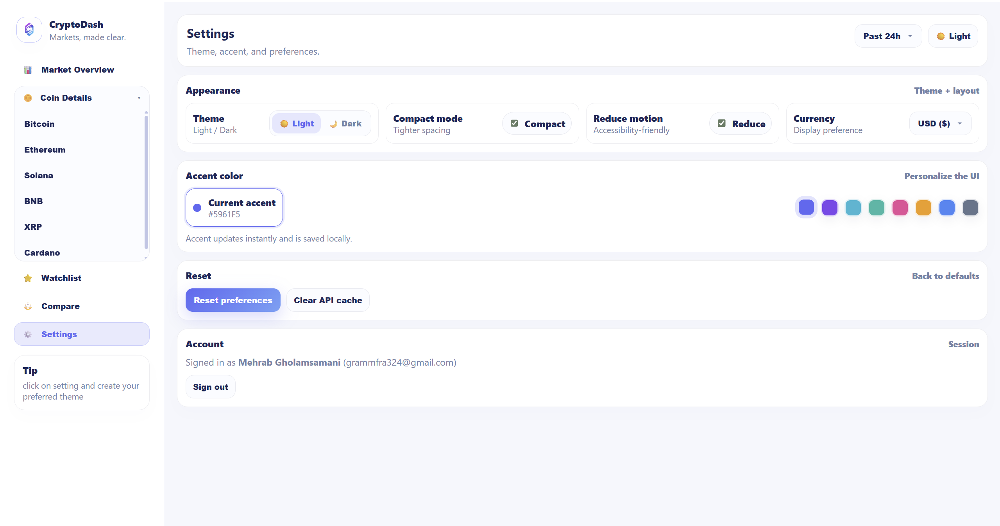

# CryptoDash 📊

> A production-style crypto analytics dashboard focused on clarity, performance, and real-world API constraints.

CryptoDash is a modern, responsive cryptocurrency dashboard built with **React** and **Chart.js**.  
It provides market overview, coin-level analysis, technical indicators, and comparison tools, designed with realistic limitations such as API rate limits, caching, and UI stability in mind.

## 🚀 Live Demo

👉 https://crypto-dash-qxk5gpswx-mehrabgholamsamanis-projects.vercel.app


## ✨ Features

### 📈 Market Overview
- Live price cards for top cryptocurrencies
- Multi-coin normalized performance chart
- Volume & liquidity visualization
- Market breadth (advancers vs decliners)
- Volatility & risk metrics (std dev, drawdown)





---

### 🪙 Coin Details
- Interactive price chart with **MA20 / MA50**
- 24h range, high/low, and trend context
- Key market metrics (market cap, volume, supply)
- Tokenomics (circulating vs remaining)
- Technical indicators:
  - RSI (14)
  - MACD (12 / 26 / 9)



---

### 📊 Indicators Panel
- RSI with overbought / oversold zones
- MACD with signal line and histogram
- Optimized for visual clarity and trend confirmation

---

### ⚖️ Compare Coins
- Compare up to **4 coins** simultaneously
- Normalized performance (%)
- Volatility & drawdown comparison
- API-safe limits to prevent rate throttling



---

### ⭐ Watchlist
- Save favorite coins locally
- Reuse watchlist for comparisons
- Persistent across sessions

---

### ⚙️ Settings
- Light / Dark theme
- Color customization
- Compact mode
- Reduced motion (accessibility)
- Local preference persistence
- Session sign-out



---

## 🧠 Engineering Decisions

- **API-aware design**  
  CoinGecko free API is rate-limited → heavy endpoints are avoided or cached to ensure stability.

- **Client-side caching**  
  Responses are cached in memory + localStorage to reduce redundant API calls.

- **Derived analytics**  
  Volatility, drawdown, trend status, and normalized performance are computed client-side.

- **UI resilience**  
  Graceful empty states and fallbacks when data is limited or unavailable.

- **No backend required**  
  Fully client-side architecture, easy to deploy and demo.

---

## 🛠️ Tech Stack

- **React**
- **Chart.js / react-chartjs-2**
- **CoinGecko API**
- **CSS (custom design system)**
- **Vite**
- **LocalStorage caching**

---

## 🚀 Running Locally

```bash
npm install
npm run dev
